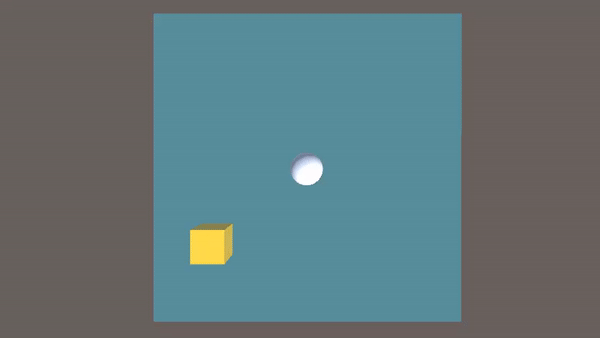

# BallRollerAgent
Ball that learns to go to a box and is rewarded +1 each time it does so and is punished -1 each time it falls off the edge. 

Built with C# and Python(MLAgents).

Made By: Samuel Boylan-Sajous (Learned this from MLAgents docs)
